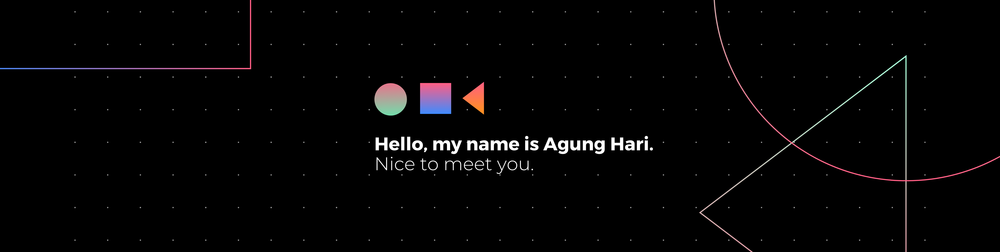

<h1 align="center">Hi 👋, I'm Agung Hari</h1>
<h3 align="center">AI Engineer from BALI</h3>

  

- 🔭 I’m currently working on [Wheelchair Control System Using Invisible Steering Gesture Based on LSTM](https://github.com/AgungHari/Wheelchair-Control-System-Using-Invisible-Steering-Gesture-Based-on-LSTM)

- 🌱 I’m currently learning **advanced AI techniques, focusing on enhancing my knowledge in machine learning, deep learning, and AI ethics to ensure responsible and impactful AI development. Additionally, I am exploring ways to improve model deployment using MLOps and studying cutting-edge technologies like Edge AI for realtime, ondevice intelligence.**

- 💬 Don't ask me about **tanah**

- ⚡ Fun fact **I play roblox**

<h3 align="left">Connect with me:</h3>

###
<h3 align="left">I have tried:</h3>

  
  
  
  
  
  
  
  
  
  
  
  
  
  
  
  
  
  
  
  
  
  
  
  
  
  
  
  
  
  
  
  
  
  
  
  
  
  
  
  
  
  
  
  
  
  
  
  
  
  
  
  
  
  
  
  
  

###
###

  
  

###

<h3 align="left">I Love this snake</h3>

###

 

###
